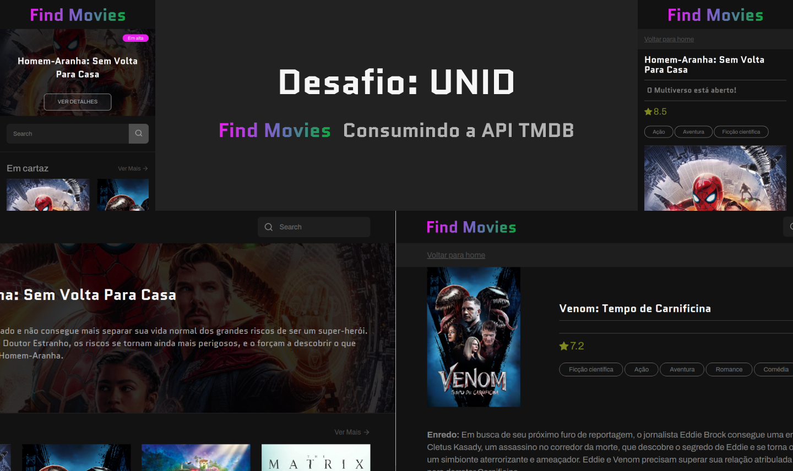
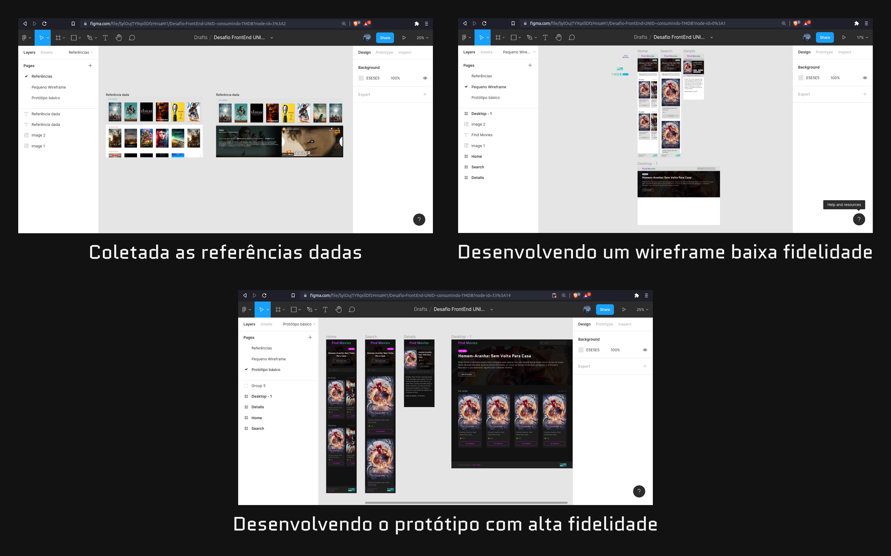

<h1 align="center">
  Desafio para vaga de Front-end na UNID
</h1>

## 📋 Tabela de conteúdo

- [Sobre](#sobre)
- [Tecnologias](#tech)
- [Desenvolvimento](#desenvolvimento)
- [Funcionalidades](#func)
- [A API](#api)
- [Executar](#exec)
  - [Requerimentos](#requerimentos)
  - [Instalando e configurando o projeto](#instalando)

<br/>

<div align="center">
   
</div>

<h2 id="sobre">
  👀 Sobre
</h2>

<p>
  Esta aplicação foi desenvolvida com o intuito de conseguir uma vaga como dev Front-end na UNID. Este desafio foi proposto e aqui está a minha versão. Aqui é possível encontrar uso de alguns Hooks do React, estilização com Sass, rotas com React Router Dom, consumo de uma API com axios, etc... Irei mostrar passa a passo do desenvolvimento e mais informações sobre o projeto.
</p>

<h2 id="tech">
  🚀 Tecnologias
</h2>

Principais tecnologias utilizadas
​

- [React](https://pt-br.reactjs.org/)
- [React Router Dom](https://reactrouter.com/)
- [Sass](https://sass-lang.com/)
- [TypeScript](https://www.typescriptlang.org/)
- [Axios](https://github.com/axios/axios)
- [ESlint](https://eslint.org/)
- [Prettier](https://prettier.io/)
- [Figma (para prototipação)](https://figma.com)

<h2 id="desenvolvimento">
  :computer: Desenvolvimento
</h2>

<p>
Para iniciar o desenvolvimento, foi me dado duas imagens com o básico que a aplicação deveria ter. Para que o trabalho ficasse mais fácil, eu tentei fazer primeiramente um protótipo no <a href="https://figma.com">Figma</a> para depois desenvolver realmente o código.
Após pegar as referências dadas e coloca-las no board, eu fui até a documentação da API que tivemos que usar e analisei quais dados eu deveria e poderia usar para por em tela. Após isso, eu desenvolvi um wireframe de baixa fidelidade. Quando finalizado o wireframe, eu acertei todas as cores e tipografia que iria usar, e desenvolvi o protótipo de alta fidelidade final.
<b>
  <a href="https://www.figma.com/file/SylOujTY9qxllDfzHnsaM1/Desafio-FrontEnd-UNID--consumindo-TMDB?node-id=87%3A13">Aqui está o arquivo no Figma para conferir</a>
</b>
</p>

<div align="center">
   
</div>

<p>
Todas as telas estão responsivas, e desde a prototipação eu pensei nas versões mobile. Utilizei a técnica de MOBILE FIRST para o desenvolvimento inteiro, que consiste em primeiro desenvolver para Mobile, e depois adaptar para versões maiores, dessa forma, fica mais fácil a manutenção do estilo e também esse processo de adaptação para telas maiores.
</p>

**TypeScript:**
Resolvi usar TypeScript, pois já estou mais acostumado e amo as vantagens que ele trás com as tipagens.

**Sass:**

O Sass pode ser usado e estruturado num projeto de variadas formas. Por estar usando React e componentização, eu achei melhor separar as telas e os componentes em pastas individuais, cada um com seu arquivo _index.tsx_ (que exporta algum react element) e seu arquivo _styles.module.scss_ (module por questão de modularizar os estilos) que contém o estilo da página e/ou elemento.

Criei um arquivo dentro de _src/styles/_ que exporta uma estilização global, em questão a modificação do tamanho do font-size de acordo com a media query para a utilização da medida relativa rem.

Dentro de _/styles/sass/abstracts_, temos dois arquivos com funcionalidades abstratas do Sass. Um é o _\_variables.scss_, que exporta as variáveis que utilizo na aplicação inteira, e o outro _\_mixins.scss_, que exporta mixins que criei para tratar a responsividade na aplicação com medias queries.

**React Router Dom:**

Usei para tratar as rotas da aplicação. Dentro da aplicação existem 3 rotas, sendo a _/_ com a página home, a _/movie/:idMovie_ que mostra os detalhes de um determinado filme de acordo com seu id passado na query, e _/movies/:query_ que mostra a listagem de filmes de acordo com a query passada na url (esta rota está sendo usada quando clicado no link _ver mais_ de alguma determinada sessão listada na home).

**Axios:**
Utilizado para fazer as chamadas nas rotas e conseguir os dados provindos da API da [TMDB](https://www.themoviedb.org/).

**Prettier e Eslint:**

Usado para a padronização e estilização do código.

<h2 id="func">
  :bulb: Funcionalidades
</h2>

- [x] Listagem de filmes em cartaz
- [x] Listagem de filmes em alta
- [x] Listagem de filmes com melhores avaliações
- [x] Componente de sessão separado para caso queira listar outros tipos de sessões
- [x] Mostrar detalhes de um filme
- [x] Pesquisa de filme

**Observações:**

1. Nos detalhes de um filme, pelo menos em minha máquina o YouTube bloqueia o vídeo que era para ser o trailer, mas mesmo assim eu deixei de uma forma que deveria estar funcionando caso isso não acontecesse.
2. Não consegui fazer o sistema de pesquisa por conta de performance, pois não consegui achar uma boa maneira que pudesse fazer pesquisa continua de acordo com a mudança do input sem que ficasse fazendo uma chamada a API a cada caractere adicionado ou retirado, por conta disso deixei não funcional e creio que isso seria bacana caso desse para usar Web Socket; Independente disso, eu vi na documentação da API como se obtém resultados de uma pesquisa.

<h2 id="api">
  :game_die: A API
</h2>

A API que foi utilizada é a API de filmes [TMDB](https://www.themoviedb.org/). Eu li a documentação e vi todas as rotas que eu precisaria, desde para dados até para as imagens.

Na documentação eles pediam no termo de uso que colocasse alguma das logos deles (que eles disponibilizam) em algum lugar da aplicação. Eu coloquei no Footer do lado direito.

<h2 id="exec">
  :tada: Executar
</h2>

<h3 id="requerimentos">
  :tada: Requerimentos
</h3>

- [Node.js](https://nodejs.org/en/)
- [Yarn](https://classic.yarnpkg.com/) ou [NPM](https://www.npmjs.com/)

<h3 id="instalando">
  :heart: Instalando e configurando o projeto
</h3>

_Clone o projeto e acesse a pasta_

```bash
$ git clone https://github.com/joaovds/desafio-unid
$ cd desafio-unid
```

_Siga agora os seguintes passos_

```bash
# Instale as dependências
$ yarn # ou npm install

# Faça uma cópia do arquivo '.env.example' com o nome '.env'
# e então coloque as variáveis de ambiente necessárias (no caso, a API KEY da TMDB)
$ cp .env.example .env

# E para finalizar, inicie o projeto com
$ yarn start # ou npm start

# Está pronto! O Projeto deve estar executando!
```
